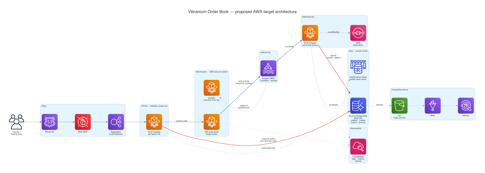

# Orderbook — Vibranium (MVP)

A limit order book that lets users place **buy** and **sell** orders for
**Vibranium** priced in Colombian pesos (COP), matches them by **price-time
priority**, and credits/debits wallets as trades execute — with full trade
traceability.

Built in **Go**. The domain core (order book, wallets, rules) is standard library
only; external dependencies live exclusively in the infrastructure adapters.

Thanks to the hexagonal design the same binary runs in **two modes**, chosen by
configuration alone:

| Mode | Command | Infrastructure |
|---|---|---|
| **Full** (default in Docker) | `make up` | Redpanda (event log), Postgres (wallets/trades/orders/journal), Redis (cache) |
| **In-memory** | `make run` or `make up-memory` | None: fully in-process, zero dependencies |

---

## Why this design

The challenge's key constraint is a paradox: **the order book cannot tolerate
concurrency** (matching must be strictly ordered and deterministic), yet
thousands of orders can arrive in the same millisecond. Real exchanges (LMAX,
Nasdaq) solve this by **serializing every order into an ordered log and running
a single-threaded matching engine**. That is exactly the shape here, and Go maps
onto it naturally:

- **One goroutine owns the order book.** All mutations flow through a single
  channel, so there are no locks and no data races on the book. Ordering is
  decided once — at the channel — then applied deterministically.
- **The ordered log is a port, not a channel.** One `EventLog` interface, two
  implementations: a Go channel in memory, and a Redpanda/Kafka partition keyed by
  symbol to preserve per-instrument order. Both are implemented and running.
- **The engine never touches money.** It only decides matches and emits events.
  A separate **settlement** consumer applies credits/debits and refunds. This
  keeps the hot path tiny and the money path auditable.

```
  Clients / bots
        │  POST /orders
        ▼
┌──────────────────┐  reserve funds (atomic)   ┌────────────────────────────┐
│   HTTP API       │──────────────────────────▶│  Wallet store (available /  │
│  (stateless,     │   row lock per user        │  locked split)              │
│   scalable)      │           place            │  memory | POSTGRES (+REDIS) │
└───────┬──────────┘─────────────┐             └────────────────────────────┘
        │                        ▼
        │              ┌────────────────────────┐  emits events
        │              │  Matching Engine        │───────────────┐
        │              │  1 goroutine, owns book │                │
        │              │  price-time priority    │                ▼
        │              └────────────────────────┘     ┌──────────────────────┐
        │                                             │  Event log           │
        │                                             │  memory | REDPANDA   │
        │                                             │  1 partition/symbol  │
        │                                             └───────┬──────────────┘
        ▼                                                     ▼
  GET /book, /trades, /wallets              ┌────────────────────────────────┐
                                            │  Settlement consumer            │
                                            │  idempotency journal (event ID) │
                                            │  applies trades, refunds        │
                                            └───────┬────────────────────────┘
                                                    ├─▶ Wallet store
                                                    ├─▶ Trade history
                                                    └─▶ Order projection
                                                        memory | POSTGRES
```

Uppercase = the durable adapters that `make up` wires in. Everything is selected
by environment variables; the core code is identical in both modes.

## The correctness core: reserve / settle / release

A user's balance is split into **available** and **locked**. This is what
prevents double-spend when a bot fires many orders in the same millisecond.

| Event | COP | Vibranium |
|-------|-----|-----------|
| Place **BUY** `qty @ price` | `qty*price` moves available → locked | — |
| Place **SELL** `qty` | — | `qty` moves available → locked |
| Trade executes (`qty @ execPrice`) | buyer: locked → spent; seller: +available | seller: locked → delivered; buyer: +available |
| Buy over-reservation refund | `qty*(limit − execPrice)` locked → available | — |
| Cancel remainder | locked → available | locked → available |

The **execution price is the resting (maker) order's price**. A buy taker may
lock more than it spends (its limit was above the maker's ask), so the
difference is refunded — see `TestBuyOverReservationRefundedEndToEnd`.

The **money invariant**: `sum(available + locked)` for COP and for Vibranium is
constant across all users. The concurrency test and the load-test both assert it.

---

## Requirements

**To run the full stack (recommended)** — this is the only hard requirement:

| Tool | Version | Why |
|---|---|---|
| Docker + Compose v2 | Docker 20.10+, Compose v2 | Runs everything: app, Redpanda, Postgres, Redis |

Nothing else is needed: the Go toolchain is not required because the binary is
compiled inside the image.

**To run it bare, or to run the tests and the load test:**

| Tool | Version | Why |
|---|---|---|
| Go | **1.26+** (see `go.mod`) | `make run`, `make test`, `make loadtest` |
| `curl` | any | The API examples below |
| `python3` | 3.x | Only for `make replay-test`, which computes balance totals |

**Ports that must be free:** `3000` (API), `5432` (Postgres), `6379` (Redis),
`19092` (Redpanda), `8080` (Redpanda Console). If one is taken, either stop the
process using it or change the mapping in `docker-compose.yml`.

**Resources:** the stack fits comfortably in ~2 GB of RAM. Postgres and Redpanda
keep their data in named Docker volumes, so state survives `make down`; use
`make reset` to wipe it.

---

## Run it

### Option A — full architecture, one command

```bash
make up
```

That's it. It builds the image, starts **five** services, waits until the API is
healthy, and applies the database schema automatically (the schema is embedded in
the binary and applied idempotently at boot, so there is no migration step to
run).

| Service | Role | Port |
|---|---|---|
| `orderbook` | API + matching engine + settlement | 3000 |
| `redpanda` | durable ordered event log (Kafka API) | 19092 |
| `postgres` | wallets, trades, orders, settlement journal | 5432 |
| `redis` | hot read cache for wallet lookups | 6379 |
| `console` | web UI to inspect the event log (optional) | 8080 |

Verify it came up:

```bash
curl -s localhost:3000/health
# {"status":"ok","symbol":"VIB","trades":0}
```

Lifecycle:

```bash
make ps          # service health
make down        # stop, keep the data volumes
make reset       # stop AND wipe all data (fresh start)
```

First `make up` pulls images and compiles, so expect a minute or two. Afterwards
it takes about 20 seconds.

### Option B — zero infrastructure

The same binary with every adapter set to `memory`. Useful to see the API working
with nothing else installed:

```bash
make run         # bare Go process on :3000 (needs Go 1.26+)
make up-memory   # single container, no dependencies (needs only Docker)
make down-memory # stop it
```

The startup log line tells you which mode you are in — see
[Viewing logs](#viewing-logs).

---

## Viewing logs

The app emits **structured JSON logs** via `slog` on stdout.

### Follow the application

```bash
make logs                        # follows the orderbook container
docker compose logs -f orderbook # same thing, directly
```

### Confirm which adapters are wired

The most useful single line. It is printed once at startup and tells you whether
you are running on real infrastructure or in memory:

```bash
docker compose logs orderbook | grep "orderbook listening"
```

```json
{"time":"...","level":"INFO","msg":"orderbook listening","addr":"0.0.0.0:3000",
 "symbol":"VIB","adapters":{"cache":"redis","eventLog":"kafka:orderbook.events",
 "journal":"postgres","orders":"postgres","trades":"postgres","wallets":"postgres"}}
```

In memory mode every value reads `memory` / `none` instead.

### Other services

```bash
docker compose logs -f postgres
docker compose logs -f redpanda
docker compose logs -f redis
docker compose logs -f            # everything, interleaved
docker compose logs --tail 50 orderbook
docker compose logs --since 5m orderbook
```

### Turn up the detail

`LOG_LEVEL` accepts `debug`, `info` (default), `warn`, `error`. `debug` adds an
access log line per HTTP request and reports skipped duplicate events:

```bash
LOG_LEVEL=debug docker compose up -d orderbook
```

For `make run`, just prefix it: `LOG_LEVEL=debug make run`.

### Filtering

Because the output is JSON, `jq` works well:

```bash
docker compose logs --no-log-prefix orderbook | jq -r 'select(.level=="ERROR")'
docker compose logs --no-log-prefix orderbook | jq -r '[.time,.level,.msg]|@tsv'
```

Errors worth knowing: `settle buy failed` / `settle sell failed` mean settlement
could not apply a trade (a reservation invariant was violated upstream), and
`wallet store unavailable` means the API is failing closed because Postgres is
unreachable.

### Beyond logs

```bash
make groups   # settlement consumer lag on the event log
make topic    # event log topic details
make psql     # psql shell (SELECT * FROM trades; etc.)
```

Redpanda Console at <http://localhost:8080> shows the raw event stream — every
trade and order update, in order, with its unique ID. It is the clearest way to
demonstrate traceability.

---

## Testing

```bash
make test       # unit + integration tests, with the race detector
make vet        # go vet
make loadtest   # 5000 buyer/seller pairs, then reconciles balances
```

`make loadtest` is the one that mirrors how the challenge is evaluated: it seeds
5000 buyers and 5000 sellers, fires all 10 000 orders concurrently, waits for
settlement to drain, then proves that no value was created or destroyed. It needs
the API running (`make up` or `make run`) in another shell. A real run:

```
placed=10000 failed=0 in 700ms (14277 orders/sec, ~7138 trades/sec)
settlement drained: 5000/5000 trades
INVARIANT: totalCOP=500000 (expected 500000) totalVibranium=5000 (expected 5000) stillLocked=0
RESULT: OK — value conserved, every order matched and settled
```

Resilience checks are documented under [Failure modes](#failure-modes-what-happens-when-a-component-fails),
including `make replay-test`, which rewinds the event log and proves money is not
duplicated.

## API

| Method | Path | Purpose |
|--------|------|---------|
| `POST` | `/wallets` | Seed/replace a wallet (testing; registration is out of scope) |
| `GET`  | `/wallets` | List all wallets (reconciliation) |
| `GET`  | `/wallets/{id}` | Get one wallet |
| `POST` | `/orders` | Place a buy/sell limit order |
| `DELETE` | `/orders/{id}` | Cancel a resting order |
| `GET`  | `/orders/{id}` | Order status |
| `GET`  | `/book?depth=N` | Aggregated order book depth |
| `GET`  | `/trades?limit=N` | Recent trades (traceability) |
| `GET`  | `/health` | Liveness + trade count |

### Example

```bash
# Seed two users
curl -s localhost:3000/wallets -d '{"userId":"alice","copAvailable":1000000,"vibraniumAvailable":0}'
curl -s localhost:3000/wallets -d '{"userId":"bob","copAvailable":0,"vibraniumAvailable":100}'

# Bob sells 50 @ 100, Alice buys 50 @ 100  -> a trade executes
curl -s localhost:3000/orders -d '{"userId":"bob","side":"SELL","price":100,"quantity":50}'
curl -s localhost:3000/orders -d '{"userId":"alice","side":"BUY","price":100,"quantity":50}'

# Inspect
curl -s localhost:3000/trades
curl -s localhost:3000/wallets/alice   # +50 Vibranium, -5000 COP
curl -s localhost:3000/wallets/bob     # -50 Vibranium, +5000 COP
```

## Failure modes (what happens when a component fails)

These are **verified behaviours** of the running stack, not aspirations:

- **Settlement replay / duplicate delivery** — the event log is at-least-once, so
  the same event can arrive twice. Every event carries a unique ID
  (`<producerID>-<sequence>`) and settlement records it in a Postgres
  **idempotency journal** before applying it. Rewinding the consumer group to
  offset 0 and re-consuming the entire log leaves balances **byte-identical**:
  ```bash
  make replay-test    # rewinds to offset 0, proves money is not duplicated
  ```
- **App crash / restart** — wallets, trades, orders and the journal live in
  Postgres, so state survives. `docker compose restart orderbook` keeps every
  balance and the full trade history.
- **Wallet store down** — the API **fails closed**: `POST /orders` returns `503`
  (`wallet store unavailable`) and no order enters the book, because no order can
  enter without a successful reservation. `/health` reports `degraded`. When
  Postgres returns, the pool reconnects and trading resumes with no restart.
- **API failure after reserving funds** — a compensating `release` runs on a
  detached context (the caller's context may already be cancelled), so funds are
  never stranded in `locked`.
- **Broker/DB slow at startup** — every adapter retries until
  `INFRA_WAIT_TIMEOUT`, and startup **refuses to boot** rather than silently
  degrading a ledger to non-durable memory.
- **Backpressure** — `Publish` hands events to an internal queue drained by a
  producer goroutine, so broker latency never blocks the single-writer engine. If
  the queue saturates the engine blocks: intentional backpressure, not silent loss.

**Known limitation, stated plainly:** the in-memory book itself is not rebuilt on
restart. Recovery of resting orders requires replaying the log into a fresh book
(plus periodic snapshots to bound replay time). The log, the event IDs and the
journal are all in place to make that possible; the replay routine itself is
deliberately out of MVP scope.

## Scaling path

- **API tier**: stateless, scale horizontally behind a load balancer. Because
  reservations take a **row-level lock in Postgres** rather than an in-process
  mutex, the no-double-spend guarantee survives multiple API replicas.
- **One asset (Vibranium)**: a single partition and one engine already exceed the
  target — measured **~14,000–14,900 orders/sec (~7,000–7,400 trades/sec)** across
  runs on a laptop against the full Redpanda+Postgres+Redis stack, with the money
  invariant holding every time.
- **More assets**: shard by **symbol** across partitions/engines — linear scaling
  per instrument. A single hot symbol is the hard ceiling; you cannot parallelize
  one book. That is a property of order books, not a flaw here.
- **Next bottleneck is settlement, and it is measured**: matching absorbs ~14k
  orders/sec but settlement applies only **~507 trades/sec**, because it issues
  roughly **14 Postgres transactions per trade** (journal insert, two wallet
  transactions with `SELECT … FOR UPDATE`, trade insert, plus the order-projection
  updates). The buffered log absorbs the burst, so a 5000-trade run shows a few
  seconds of settlement lag rather than failures. The fix is **micro-batching**
  (many events per transaction), not parallelism: because funds are reserved
  up front, settlements are commutative, but batching preserves ordering and
  gives atomicity for free — it also closes the non-atomic two-leg gap noted
  below. Deliberately left out of the MVP to keep the code simple.

### Known gaps, stated plainly

Three things I found by probing the running system and chose not to fix, to keep
the MVP small. They are listed here rather than hidden because knowing about them
is more valuable than a clean-looking README:

1. **`int64` overflow in the reservation.** `ReservedCOP()` computes
   `Price * Quantity` unguarded, so an order with `price = quantity = 2^32` wraps
   to a reservation of `0` and is accepted with no collateral. Fix: validate that
   the product does not overflow, ideally alongside configurable max price/size
   (a market-sanity band).
2. **A trade's two legs are not atomic.** The buyer and seller updates are
   separate transactions, so if the buyer's leg fails the seller's still applies —
   which credits COP that was never debited. The micro-batching change above
   fixes this as a side effect.
3. **`POST /wallets` overwrites locked funds.** It is an upsert that resets
   `locked` to zero, so re-seeding a user who has resting orders leaves those
   orders in the book with no collateral behind them. Fix: reject the re-seed with
   `409` when locked funds exist, or make seeding additive.

## Future AWS deployment

The local stack was chosen so that every piece has a managed AWS equivalent: the
adapters already speak the standard protocols (Kafka, PostgreSQL, Redis), so
moving to the cloud is a change of connection strings, not of code.

> This is a **proposed** target architecture, not something deployed — the MVP
> runs locally. Click the image for full resolution.



Read it left to right: clients enter through the edge, the API tier reserves funds
against Aurora, the matching tier emits events to MSK, and settlement consumes
them and is the only component writing credits and debits. Edge colours separate
the concerns — **red** is the money path, **blue** is the ordered event log, grey
is plain request flow and supporting traffic.

The diagram is generated from
[`docs/architecture/aws_architecture.py`](docs/architecture/aws_architecture.py)
using the official AWS Architecture Icons, so it stays reviewable as code:

```bash
make diagram    # needs graphviz + the diagrams package (see the target)
```

### Component mapping

| Local | AWS | Notes |
|---|---|---|
| Redpanda | **Amazon MSK** (or MSK Serverless) | Kafka-compatible, so `kafkalog` works unchanged. One partition per symbol preserves per-book ordering |
| Postgres | **Aurora PostgreSQL** Multi-AZ | `SELECT … FOR UPDATE` semantics are identical; a reader endpoint can serve `GET /wallets` reconciliation |
| Redis | **ElastiCache for Redis** | Same client, same decorator |
| `docker compose` | **ECS on Fargate** | No servers to manage; EC2 is worth considering for the matching tier if you need tighter tail latency |
| container image | **ECR** | The existing distroless image is already tiny and non-root |
| `slog` to stdout | **CloudWatch Logs** | JSON logs are queryable as-is with Logs Insights |
| — | **Secrets Manager** | Replaces the plaintext `DATABASE_URL` in compose |
| — | **S3 + Glue + Athena** | Long-term trade archive for the traceability requirement |
| — | **SQS** | Dead letter for events settlement cannot apply |

### The one thing that must change: split the binary

Today the API and the matching engine live in the **same process** and talk over a
Go channel. That is what makes the local setup a single container, but it does not
survive horizontal scaling: if you ran three API tasks, each would own its **own
copy** of the VIB book, and you would have three divergent order books for one
instrument. Correctness would be gone.

So in AWS the deployable splits in two:

- **API tier** — stateless, any number of tasks. It validates, reserves funds
  against Aurora (the row lock is what keeps double-spend impossible across
  replicas), and forwards the order.
- **Matching tier** — **exactly one task per symbol.** Not an autoscaling group: a
  singleton, because a single book cannot be parallelized.

Two ways to connect them, with a real trade-off:

| Approach | How | Cost |
|---|---|---|
| **Synchronous** | API calls the engine over gRPC/HTTP; engine stays a singleton service | Keeps today's API contract (`201` with the fill result). Adds a network hop and makes the engine a SPOF that needs a hot standby |
| **Log-based** | API publishes to an `orders` topic; the engine consumes it | More resilient and uniform with the rest of the design. But placement becomes asynchronous: the API returns `202 Accepted` and clients poll `GET /orders/{id}` or subscribe to updates |

I would take the log-based route for production, because it makes the ordered log
the single source of truth for both input and output, which is what allows a
standby engine to take over by replaying.

### Prerequisite before any of this ships

Engine failover depends on **rebuilding the book from the log**, and that routine
is the [known limitation](#failure-modes-what-happens-when-a-component-fails) of
this MVP. Everything needed is already in place — a durable ordered log, unique
event IDs, an idempotency journal — but the replay-and-snapshot logic itself is
not written. It is the first thing to build before a cloud deployment, because
without it a matching-tier restart loses every resting order.

---

## Observability

Structured JSON logs via `slog`, including the selected adapters at startup.
`/health` surfaces dependency failure instead of lying `ok`. Redpanda Console
(`:8080`) shows the raw event log for traceability demos, and `make groups` shows
settlement consumer lag.

Metrics to add next: orders/sec, match latency, book depth, log lag, settlement
latency, and a periodic **reconciliation job** that proves the money invariant in
production.

## Project layout (hexagonal / ports & adapters)

The code follows a hexagonal architecture: a pure core (domain + use cases)
surrounded by ports (interfaces) and adapters (infrastructure). Dependencies
point **inward** — adapters depend on the core, never the reverse.

```
cmd/orderbook                     composition root: wires adapters to services, graceful shutdown

internal/core/                    THE APPLICATION CORE (no transport/storage deps)
  domain/                         entities + rules: order, trade, wallet, events, the pure order book
  port/                           interfaces: inbound (driving) + outbound (driven) ports
  service/                        use cases: trading, settlement, market data, wallets

internal/adapter/                 INFRASTRUCTURE (implements the ports)
  driving/rest/                   HTTP adapter (net/http, stateless) -> calls inbound ports
  driven/matching/                single-goroutine matching engine  -> MatchingEngine
  driven/memstore/                in-memory repos + journal          -> repositories
  driven/memlog/                  in-memory ordered event log        -> EventLog
  driven/postgres/                durable repos + idempotency journal (row locks, schema.sql)
  driven/kafkalog/                Redpanda/Kafka ordered event log
  driven/rediscache/              Redis read-cache DECORATOR over any WalletRepository

internal/bootstrap                picks the adapters from configuration (the only
                                  place that knows both "memory" and "postgres" exist)
internal/config                   env-based configuration
scripts/loadtest                  concurrent bot client + balance-invariant checker
```

**Ports** live in `internal/core/port`:
- *Inbound (driving):* `TradingService`, `MarketDataService`, `WalletService` —
  what the app offers; implemented by `internal/core/service`, called by the REST adapter.
- *Outbound (driven):* `MatchingEngine`, `WalletRepository`, `TradeRepository`,
  `OrderRepository`, `EventLog`, `EventJournal` — what the app needs; implemented
  by `internal/adapter/driven/*`.

Every adapter pair implements the same port, so infrastructure is a **configuration
choice, not a code change**:

| Port | `memory` | real |
|---|---|---|
| `EventLog` | Go channel | **Redpanda/Kafka**, 1 partition per symbol |
| `WalletRepository` | `RWMutex` map | **Postgres** + `SELECT … FOR UPDATE` |
| `TradeRepository` | slice | **Postgres** append-only |
| `OrderRepository` | map | **Postgres** (monotonic by sequence) |
| `EventJournal` | set | **Postgres** `processed_events` |
| cache | — | **Redis** decorator over the above |

The Redis adapter is worth calling out: it is a **decorator**, implementing
`WalletRepository` and wrapping the durable one. Caching is composed in at the
composition root, and neither the core nor Postgres knows it exists.

## Scope

**Built and verified:** limit buy/sell, cancel, price-time matching,
reserve/settle/release, trade history, one asset, the ordered-log architecture,
tests, load test, and the **real infrastructure adapters** (Redpanda + Postgres +
Redis) with an idempotency journal, durability across restarts, and fail-closed
behaviour when the database is down.

**Out of scope** (intentionally, to avoid overengineering): GUI,
auth/registration, market orders, and **rebuilding the book by replaying the log
on startup** (plus snapshots) — the known limitation described under Failure
modes.

---

## References / prior art

Implementations and articles reviewed while researching the problem. Listed with
what each contributes and where it differs from the choices made here — the
contrast is what justifies the design. See
[DOCUMENTACION.md §13](DOCUMENTACION.md#13-referencias-y-estado-del-arte) for the
detailed comparison.

*Content paraphrased from the linked sources; original code and full detail live at each link.*

| Source | Contributes | Differs from this project |
|---|---|---|
| [i25959341/orderbook](https://github.com/i25959341/orderbook) | Most complete Go matching engine: price-time priority, limit + market orders, >300k trades/sec | Uses `shopspring/decimal`; here money is exact `int64`. Book only — no wallets or settlement |
| [danielgatis/go-orderbook](https://github.com/danielgatis/go-orderbook) | HFT limit order book following WK Selph's data-structure write-up; exposes aggregated `Depth()` | Book only; no money path |
| [ricardohsd/order-book](https://github.com/ricardohsd/order-book) | Minimal limit order book for crypto exchanges | Author notes it is a pet project, not production-used |
| [bhomnick — Building an exchange limit order book in Go](https://bhomnick.net/building-a-simple-limit-order-in-go/) | Price-indexed pre-allocated array + per-level linked lists for O(1) ops; lazy cancellation; 350k–2M actions/sec | That array caps the price range and costs memory proportional to it; here a map + sorted slice trades O(1) for O(log n) with no price ceiling. **Its "next steps" describe this project's architecture**: a Kafka-style log to rebuild the book after a crash, and settlement decoupled from the engine |
| [Aditya Raj — Market Depth Simplified](https://medium.com/@adityaraj_201551/market-depth-simplified-building-an-order-book-engine-in-go-9abb9bcaec9a) + [repo](https://github.com/aditya201551/in-memory-order-book-go) | Why a **B-tree** suits price levels: sorted keys plus efficient range queries as the best price ticks | Uses `float64` for money, which accumulates rounding error — the reason this project uses integers. B-tree is the natural next step here if price levels grow |
| [Majid Imanzade — Order Book Processing with Go's Pipeline Pattern](https://medium.com/@majidimanzade1/building-efficient-order-book-processing-with-gos-pipeline-pattern-10b5e752029a) | Channel-connected pipeline stages, each returning a channel, with fan-out inside I/O-heavy stages | Pipelines the **building of depth snapshots**, not matching. A read projection parallelizes freely; an order book needs a total order, which is why matching stays single-goroutine here |

**What none of them cover:** the money. No wallets, no available/locked split, no
credits and debits on execution, no decoupled settlement. That is the core of the
challenge and lives here in `core/domain/wallet.go` and
`core/service/settlement.go`.
